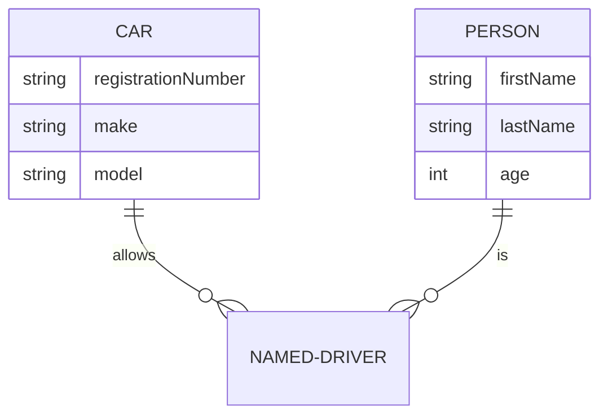
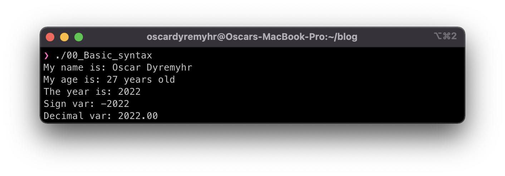

# The return of COBOL: Takeaways from a newbie

## Introduction to COBOL

I was ready for a new adventure. I had heard about the ***CO**mmon **B**usiness-**O**riented **L**anguage* aka [COBOL](https://en.wikipedia.org/wiki/COBOL), introduced over half a decade ago and its recent [resurection in demand](https://www.hackerrank.com/blog/the-inevitable-return-of-cobol/). I wanted to explore it further to see what it was all about as it’s not the most popular and liked language amongst programmers, being that it is extremely old with huge limitations compared to today’s modern languages... Yet, remarkably, although being more than 60 years old it is still alive and hidden in many huge legacy codebases in the form of spaghetti code. This is mainly as a result of companies not having the time nor the investments to do a complete code re-build and system re-design to migrate to something more elegant and modern like cloud computing. 

This is especially the case in the financial sector in where 95% of ATMs and 80% of all in-person credit card transaction done in the US rely on COBOL, [according to Reuters](http://fingfx.thomsonreuters.com/gfx/rngs/USA-BANKS-COBOL/010040KH18J/). With the demand for COBOL resurecting, but the supply off new developers being limited due to the aging and high avg. age of the COBOL devloper (mostly due to the language being so old and developers going out in retirement) a recent push has been made to keep these legacy systems afloat. Such as IBM having started offering a free [COBOL Course.](https://www.ibm.com/blogs/ibm-training/free-course-announcing-learning-cobol-programming-with-vscode/)


If you are unfamiliar with COBOL and its history a good place to start is by watching this [brief introduction in 100 seconds](https://www.youtube.com/watch?v=7d7-etf-wNI). **Notice the mockery!**

While I have no intention any time soon on managing complex legacy code from half a century ago, I am still curious as to how the technology and systems was built back in the days and how it has changed since. That is why I decided to take the IBM course so you didn't have to, and share my thoughts and takeaways, with gracious help from Derek Banas and his Youtube Tutorial: 

<iframe width="560" height="315" src="https://www.youtube.com/embed/TBs7HXI76yU" title="YouTube video player" frameborder="0" allow="accelerometer; autoplay; clipboard-write; encrypted-media; gyroscope; picture-in-picture" allowfullscreen></iframe>

## The basics of COBOL


Let's compare the basics of printing “Hello World” in Python, JS, and COBOL:

```
# 🐍 Python
print('Hello World')

# 👩‍💻 Javascript
console.log('Hello World')

# 😯 COBOL
000001 IDENTIFICATION DIVISION.
000002 PROGRAM-ID.     HELLOWORLD.
000003 ENVIRONMENT DIVISION.
000004 DATA DIVISION.
000005 PROCEDURE DIVISION.
000006
000007     DISPLAY 'HELLO WORLD.'.
000008     STOP RUN.
```

On first glance, one can clearly see the difference betweeen the modern laguages (Python and JS) compared to the old school (COBOL). What is interesting here are the line numbers and the indentation, as COBOL back in the day was written on actual physical punch cards! Additionally, the program is organized in four DIVISIONS; IDENTIFICATION, ENVIRONMENT, DATA and PROCEDURE. The IDENTIFICATION DIVISION in which identifies the program being the mandatory one to include in each program. 

### COBOL sctructure
A COBOL program follows this [structure](https://www.mainframestechhelp.com/tutorials/cobol/program-structure.htm):


- Divisions
  - Sections
    - Paragraphs
      - Sentences
        - Statements
          - Characters

### Data types

COBOL mainly has 5 [data types](https://www.mainframestechhelp.com/tutorials/cobol/data-types.htm):

- Numeric
  - Declare uisng 9
- Alphabet
  - Decalre using A
- Alpha-numeric
  - Declare using X
- Sign
  - Declare using S
- Decimal point
  - Declare using P/V

Examples:

```
9(3) - Numeeric value (0-9) with 3 digits
A(3) - Alphabet (A-Z, a-z, special characters) with 3 characters
X(3) - Alpha-numeric (A-Z, a-z, 0-9, special charcters)
S9(3) - Signed numeric value with 3 digits
9(3)V9(2) - Numeric value with 3 digits, and 2 decimal points
```
### Defining a variable

Going forward, I will use >> SOURCE FROMAT FREE to write COBOL in free format. I will also avoid typing the sequence numbers as it is not necessary to compile. 

`PICTURE` or `PIC` clause describes the characteristics of the variable.
`VALUE` describes the literal value the variable should be initialized with.

Example program:

 ```COBOL
       >> SOURCE FORMAT FREE

IDENTIFICATION DIVISION.
*> Identification -> Program information
PROGRAM-ID. hello.
AUTHOR.  Oscar Dyremyhr

ENVIRONMENT DIVISION.
*> Environment -> Specifies computer environemnt

DATA DIVISION.
*> Data -> Defines variables
WORKING-STORAGE SECTION.
01 MyName PIC A(30) VALUE "Oscar Dyremyhr". *> Variable (Alphabet)
01 MyAge PIC X(30) VALUE "27 years old". *> Variable (Alpha-numeric)
01 Year PIC 9(4) VALUE 2022. *> Variable (Numeric)
01 SignNum PIC S9(4) VALUE -2022. *> Variable (Sign)
01 DecNum PIC 9(4)V9(2) VALUE 2022.00. *> Variable (Decimal)

PROCEDURE DIVISION.
*> Procdure -> Execution plan
DISPLAY "My name is: " MyName.
DISPLAY "My age is: " MyAge.
DISPLAY "The year is: " Year.
DISPLAY "Sign var: " SignNum.
DISPLAY "Decimal var: " DecNum.
STOP RUN.

 ```

Output:




Despite its flaws, COBOL remains an easy language to learn and read, since it targets non-technical people ("Business people") by using English-like statements similar to that of SQL. It’s extremely stable and precise, thus its longevity. However, this is also why many people hait it. Critizing it for irs verbosity, and design process.

## How to setup a COBOL environment

If you want to mess with COBOL, you can write your program in a popular IDLE editor like VScode. I would reccomend installing a COBOL extension to get syntax highlighting and auto-completion.

Derek Banas video and [this blog post for windows](https://www.it-cooking.com/projects/how-to-install-gnucobol-for-cygwin/) or [this one for Mac](https://www.geeksforgeeks.org/how-to-install-cobol-on-macos/) contain a step-by-step installation guide. I’ll leave you to them if you are really willing to follow my path, as I want to keep the post lightweight. 

In short, in order for it to compile on my Mac I had to do the following:
- Install VScode and COBOL exteension
- Install Brew
- Install gnu-cobol using Brew

Ran `cobc -x program_name.cob` in the terminnal on the same directory the COBOL file was located. This creates an executable you can either launch or run in the terminal using `./program_name`

## What I did
I mostly messed around with COBOL’s basic commands, created some tables, an interactive menu, performed calculations and logical operations. 

You can find a folder with my experiments [here](https://github.com/mutt0-ds/cobol-experiments), most of them are taken from the Derek Banas tutorial. 

After having coded a bit, I tackled [IBM’s course](https://www.ibm.com/blogs/ibm-training/free-course-announcing-learning-cobol-programming-with-vscode/), which is not very long (16 hours, in theory, it took me way less to finish it because I already knew the basics) and adds some details about the different parts of a COBOL program, the differences between some versions and some simple patterns. 

## My takeaways
- With COBOL, creating long spaghetti code is extremely easy and often unavoidable. It’s not an OOP, all the variables are global, loops and functions are extremely verbose, and importing other modules is not so easy.

---


- It’s also very clear and stable, and a non-technical person can easily read the code and figure out what it does.
- I can see why COBOL has been the standard for ATMs all over the world: it’s very powerful for making calculations, building reports and simple interactive menus to display on the terminal as an ATM does. 
- There are several sections, for example for defining the data, the environment, the variables and then the process.
- The most annoying detail for me is that you have to define in advance (in the WORKING-STORAGE SECTION) the type and the size of the global variables you are going to use. If, for example, a string is longer than the N characters you’ve assigned to its variable, well screw you, it will be truncated. If it’s shorter, then COBOL will add a bunch of spaces before it.
- Also, arrays start at 1. So weird!
- The stability and the rigidity of the language are evident, I can see why it’s so difficult to replace without adding bugs, especially on mathematical operations.

## What have I learned?
Studying COBOL has certainly opened my eyes to how much technology has evolved during the years, but at the same time, I am fascinated by how this 63-year-old creature has kept many similarities to today’s stacks, for example with IF and SWITCH statements, tables, and functions. The basics are always the same. 

I don’t recommend IBM’s course, verbose and not very intuitive (unless you want the certification?), while Derek’s tutorial helped in getting my hands dirty and with the setup.

It's easy to make fun of COBOL and its archaic limits, but let’s not forget the people that were writing my same codes on punch cards, without IDEs, Stack Overflow, the Internet… And this code written in such an ancient context is still up today, working incessantly, giving your money when you use the ATM. Jokes apart, I would be proud of it.