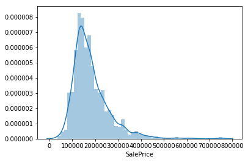
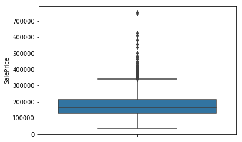
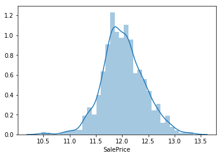
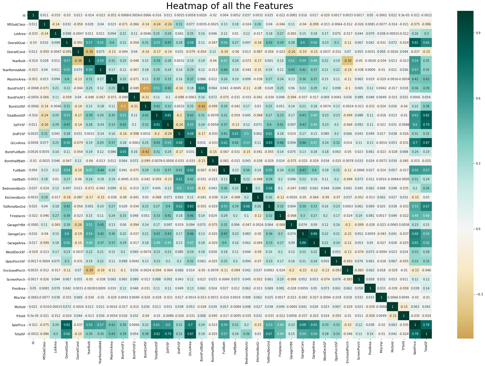

# Day 1 - House Price Prediction using Sci-Kit Learn

Data used from Kaggle - link

Explantory Variables - 79 unique

Target variable - Price

Aim - use SKLearn to predict house prices, aim to place in the mid-top 30% range in the competition. 


```python
#import all necessary libraries/dependencies
#standard packages for data processing/cleaning
import pandas as pd
import numpy as np
import seaborn as sns
import matplotlib.pyplot as plt
%matplotlib inline

#ML packages
from sklearn.metrics import mean_squared_error
from sklearn.preprocessing import StandardScaler
from sklearn.linear_model import LinearRegression,Ridge,Lasso
from sklearn.ensemble import RandomForestRegressor,GradientBoostingRegressor
from sklearn.model_selection import train_test_split,cross_val_score,GridSearchCV,RandomizedSearchCV
#import xgboost as xgb


```


```python
#loading dataset
train = pd.read_csv("Data/house_train.csv")
test = pd.read_csv("Data/house_test.csv")
train.head()
```


<div>
<style scoped>
    .dataframe tbody tr th:only-of-type {
        vertical-align: middle;
    }

    .dataframe tbody tr th {
        vertical-align: top;
    }

    .dataframe thead th {
        text-align: right;
    }
</style>
<table border="1" class="dataframe">
  <thead>
    <tr style="text-align: right;">
      <th></th>
      <th>Id</th>
      <th>MSSubClass</th>
      <th>MSZoning</th>
      <th>LotFrontage</th>
      <th>LotArea</th>
      <th>Street</th>
      <th>Alley</th>
      <th>LotShape</th>
      <th>LandContour</th>
      <th>Utilities</th>
      <th>...</th>
      <th>PoolArea</th>
      <th>PoolQC</th>
      <th>Fence</th>
      <th>MiscFeature</th>
      <th>MiscVal</th>
      <th>MoSold</th>
      <th>YrSold</th>
      <th>SaleType</th>
      <th>SaleCondition</th>
      <th>SalePrice</th>
    </tr>
  </thead>
  <tbody>
    <tr>
      <th>0</th>
      <td>1</td>
      <td>60</td>
      <td>RL</td>
      <td>65.0</td>
      <td>8450</td>
      <td>Pave</td>
      <td>NaN</td>
      <td>Reg</td>
      <td>Lvl</td>
      <td>AllPub</td>
      <td>...</td>
      <td>0</td>
      <td>NaN</td>
      <td>NaN</td>
      <td>NaN</td>
      <td>0</td>
      <td>2</td>
      <td>2008</td>
      <td>WD</td>
      <td>Normal</td>
      <td>208500</td>
    </tr>
    <tr>
      <th>1</th>
      <td>2</td>
      <td>20</td>
      <td>RL</td>
      <td>80.0</td>
      <td>9600</td>
      <td>Pave</td>
      <td>NaN</td>
      <td>Reg</td>
      <td>Lvl</td>
      <td>AllPub</td>
      <td>...</td>
      <td>0</td>
      <td>NaN</td>
      <td>NaN</td>
      <td>NaN</td>
      <td>0</td>
      <td>5</td>
      <td>2007</td>
      <td>WD</td>
      <td>Normal</td>
      <td>181500</td>
    </tr>
    <tr>
      <th>2</th>
      <td>3</td>
      <td>60</td>
      <td>RL</td>
      <td>68.0</td>
      <td>11250</td>
      <td>Pave</td>
      <td>NaN</td>
      <td>IR1</td>
      <td>Lvl</td>
      <td>AllPub</td>
      <td>...</td>
      <td>0</td>
      <td>NaN</td>
      <td>NaN</td>
      <td>NaN</td>
      <td>0</td>
      <td>9</td>
      <td>2008</td>
      <td>WD</td>
      <td>Normal</td>
      <td>223500</td>
    </tr>
    <tr>
      <th>3</th>
      <td>4</td>
      <td>70</td>
      <td>RL</td>
      <td>60.0</td>
      <td>9550</td>
      <td>Pave</td>
      <td>NaN</td>
      <td>IR1</td>
      <td>Lvl</td>
      <td>AllPub</td>
      <td>...</td>
      <td>0</td>
      <td>NaN</td>
      <td>NaN</td>
      <td>NaN</td>
      <td>0</td>
      <td>2</td>
      <td>2006</td>
      <td>WD</td>
      <td>Abnorml</td>
      <td>140000</td>
    </tr>
    <tr>
      <th>4</th>
      <td>5</td>
      <td>60</td>
      <td>RL</td>
      <td>84.0</td>
      <td>14260</td>
      <td>Pave</td>
      <td>NaN</td>
      <td>IR1</td>
      <td>Lvl</td>
      <td>AllPub</td>
      <td>...</td>
      <td>0</td>
      <td>NaN</td>
      <td>NaN</td>
      <td>NaN</td>
      <td>0</td>
      <td>12</td>
      <td>2008</td>
      <td>WD</td>
      <td>Normal</td>
      <td>250000</td>
    </tr>
  </tbody>
</table>
<p>5 rows × 81 columns</p>
</div>


```python
#basic stats
train.describe()
train['GrLivArea'].describe()
```


    count    1460.000000
    mean     1515.463699
    std       525.480383
    min       334.000000
    25%      1129.500000
    50%      1464.000000
    75%      1776.750000
    max      5642.000000
    Name: GrLivArea, dtype: float64


```python
#Save the 'Id' column
train_ID = train['Id']
test_ID = test['Id']

#Now drop the  'Id' colum since it's unnecessary for  the prediction process.
train.drop("Id", axis = 1, inplace = True)
test.drop("Id", axis = 1, inplace = True)

#adding target as a variable (Just in case)
target = df["SalePrice"]

train.head()

```


<div>
<style scoped>
    .dataframe tbody tr th:only-of-type {
        vertical-align: middle;
    }

    .dataframe tbody tr th {
        vertical-align: top;
    }

    .dataframe thead th {
        text-align: right;
    }
</style>
<table border="1" class="dataframe">
  <thead>
    <tr style="text-align: right;">
      <th></th>
      <th>MSSubClass</th>
      <th>MSZoning</th>
      <th>LotFrontage</th>
      <th>LotArea</th>
      <th>Street</th>
      <th>Alley</th>
      <th>LotShape</th>
      <th>LandContour</th>
      <th>Utilities</th>
      <th>LotConfig</th>
      <th>...</th>
      <th>PoolArea</th>
      <th>PoolQC</th>
      <th>Fence</th>
      <th>MiscFeature</th>
      <th>MiscVal</th>
      <th>MoSold</th>
      <th>YrSold</th>
      <th>SaleType</th>
      <th>SaleCondition</th>
      <th>SalePrice</th>
    </tr>
  </thead>
  <tbody>
    <tr>
      <th>0</th>
      <td>60</td>
      <td>RL</td>
      <td>65.0</td>
      <td>8450</td>
      <td>Pave</td>
      <td>NaN</td>
      <td>Reg</td>
      <td>Lvl</td>
      <td>AllPub</td>
      <td>Inside</td>
      <td>...</td>
      <td>0</td>
      <td>NaN</td>
      <td>NaN</td>
      <td>NaN</td>
      <td>0</td>
      <td>2</td>
      <td>2008</td>
      <td>WD</td>
      <td>Normal</td>
      <td>208500</td>
    </tr>
    <tr>
      <th>1</th>
      <td>20</td>
      <td>RL</td>
      <td>80.0</td>
      <td>9600</td>
      <td>Pave</td>
      <td>NaN</td>
      <td>Reg</td>
      <td>Lvl</td>
      <td>AllPub</td>
      <td>FR2</td>
      <td>...</td>
      <td>0</td>
      <td>NaN</td>
      <td>NaN</td>
      <td>NaN</td>
      <td>0</td>
      <td>5</td>
      <td>2007</td>
      <td>WD</td>
      <td>Normal</td>
      <td>181500</td>
    </tr>
    <tr>
      <th>2</th>
      <td>60</td>
      <td>RL</td>
      <td>68.0</td>
      <td>11250</td>
      <td>Pave</td>
      <td>NaN</td>
      <td>IR1</td>
      <td>Lvl</td>
      <td>AllPub</td>
      <td>Inside</td>
      <td>...</td>
      <td>0</td>
      <td>NaN</td>
      <td>NaN</td>
      <td>NaN</td>
      <td>0</td>
      <td>9</td>
      <td>2008</td>
      <td>WD</td>
      <td>Normal</td>
      <td>223500</td>
    </tr>
    <tr>
      <th>3</th>
      <td>70</td>
      <td>RL</td>
      <td>60.0</td>
      <td>9550</td>
      <td>Pave</td>
      <td>NaN</td>
      <td>IR1</td>
      <td>Lvl</td>
      <td>AllPub</td>
      <td>Corner</td>
      <td>...</td>
      <td>0</td>
      <td>NaN</td>
      <td>NaN</td>
      <td>NaN</td>
      <td>0</td>
      <td>2</td>
      <td>2006</td>
      <td>WD</td>
      <td>Abnorml</td>
      <td>140000</td>
    </tr>
    <tr>
      <th>4</th>
      <td>60</td>
      <td>RL</td>
      <td>84.0</td>
      <td>14260</td>
      <td>Pave</td>
      <td>NaN</td>
      <td>IR1</td>
      <td>Lvl</td>
      <td>AllPub</td>
      <td>FR2</td>
      <td>...</td>
      <td>0</td>
      <td>NaN</td>
      <td>NaN</td>
      <td>NaN</td>
      <td>0</td>
      <td>12</td>
      <td>2008</td>
      <td>WD</td>
      <td>Normal</td>
      <td>250000</td>
    </tr>
  </tbody>
</table>
<p>5 rows × 80 columns</p>
</div>


```python
# From EDA obvious outliers
train = train[train.GrLivArea < 4500]
train.reset_index(drop=True, inplace=True)

outliers = [30, 88, 462, 631, 1322]
train = train.drop(train.index[outliers])
```


```python
#printing out all columns for Train and Test + Shape
print (train.columns)
print(test.columns)
print(train.shape,test.shape)
```

    Index(['MSSubClass', 'MSZoning', 'LotFrontage', 'LotArea', 'Street', 'Alley',
           'LotShape', 'LandContour', 'Utilities', 'LotConfig', 'LandSlope',
           'Neighborhood', 'Condition1', 'Condition2', 'BldgType', 'HouseStyle',
           'OverallQual', 'OverallCond', 'YearBuilt', 'YearRemodAdd', 'RoofStyle',
           'RoofMatl', 'Exterior1st', 'Exterior2nd', 'MasVnrType', 'MasVnrArea',
           'ExterQual', 'ExterCond', 'Foundation', 'BsmtQual', 'BsmtCond',
           'BsmtExposure', 'BsmtFinType1', 'BsmtFinSF1', 'BsmtFinType2',
           'BsmtFinSF2', 'BsmtUnfSF', 'TotalBsmtSF', 'Heating', 'HeatingQC',
           'CentralAir', 'Electrical', '1stFlrSF', '2ndFlrSF', 'LowQualFinSF',
           'GrLivArea', 'BsmtFullBath', 'BsmtHalfBath', 'FullBath', 'HalfBath',
           'BedroomAbvGr', 'KitchenAbvGr', 'KitchenQual', 'TotRmsAbvGrd',
           'Functional', 'Fireplaces', 'FireplaceQu', 'GarageType', 'GarageYrBlt',
           'GarageFinish', 'GarageCars', 'GarageArea', 'GarageQual', 'GarageCond',
           'PavedDrive', 'WoodDeckSF', 'OpenPorchSF', 'EnclosedPorch', '3SsnPorch',
           'ScreenPorch', 'PoolArea', 'PoolQC', 'Fence', 'MiscFeature', 'MiscVal',
           'MoSold', 'YrSold', 'SaleType', 'SaleCondition', 'SalePrice'],
          dtype='object')
    Index(['MSSubClass', 'MSZoning', 'LotFrontage', 'LotArea', 'Street', 'Alley',
           'LotShape', 'LandContour', 'Utilities', 'LotConfig', 'LandSlope',
           'Neighborhood', 'Condition1', 'Condition2', 'BldgType', 'HouseStyle',
           'OverallQual', 'OverallCond', 'YearBuilt', 'YearRemodAdd', 'RoofStyle',
           'RoofMatl', 'Exterior1st', 'Exterior2nd', 'MasVnrType', 'MasVnrArea',
           'ExterQual', 'ExterCond', 'Foundation', 'BsmtQual', 'BsmtCond',
           'BsmtExposure', 'BsmtFinType1', 'BsmtFinSF1', 'BsmtFinType2',
           'BsmtFinSF2', 'BsmtUnfSF', 'TotalBsmtSF', 'Heating', 'HeatingQC',
           'CentralAir', 'Electrical', '1stFlrSF', '2ndFlrSF', 'LowQualFinSF',
           'GrLivArea', 'BsmtFullBath', 'BsmtHalfBath', 'FullBath', 'HalfBath',
           'BedroomAbvGr', 'KitchenAbvGr', 'KitchenQual', 'TotRmsAbvGrd',
           'Functional', 'Fireplaces', 'FireplaceQu', 'GarageType', 'GarageYrBlt',
           'GarageFinish', 'GarageCars', 'GarageArea', 'GarageQual', 'GarageCond',
           'PavedDrive', 'WoodDeckSF', 'OpenPorchSF', 'EnclosedPorch', '3SsnPorch',
           'ScreenPorch', 'PoolArea', 'PoolQC', 'Fence', 'MiscFeature', 'MiscVal',
           'MoSold', 'YrSold', 'SaleType', 'SaleCondition'],
          dtype='object')
    (1453, 80) (1459, 79)


```python
train.head(7) #first 7 rows from Train
```


<div>
<style scoped>
    .dataframe tbody tr th:only-of-type {
        vertical-align: middle;
    }

    .dataframe tbody tr th {
        vertical-align: top;
    }

    .dataframe thead th {
        text-align: right;
    }
</style>
<table border="1" class="dataframe">
  <thead>
    <tr style="text-align: right;">
      <th></th>
      <th>MSSubClass</th>
      <th>MSZoning</th>
      <th>LotFrontage</th>
      <th>LotArea</th>
      <th>Street</th>
      <th>Alley</th>
      <th>LotShape</th>
      <th>LandContour</th>
      <th>Utilities</th>
      <th>LotConfig</th>
      <th>...</th>
      <th>PoolArea</th>
      <th>PoolQC</th>
      <th>Fence</th>
      <th>MiscFeature</th>
      <th>MiscVal</th>
      <th>MoSold</th>
      <th>YrSold</th>
      <th>SaleType</th>
      <th>SaleCondition</th>
      <th>SalePrice</th>
    </tr>
  </thead>
  <tbody>
    <tr>
      <th>0</th>
      <td>60</td>
      <td>RL</td>
      <td>65.0</td>
      <td>8450</td>
      <td>Pave</td>
      <td>NaN</td>
      <td>Reg</td>
      <td>Lvl</td>
      <td>AllPub</td>
      <td>Inside</td>
      <td>...</td>
      <td>0</td>
      <td>NaN</td>
      <td>NaN</td>
      <td>NaN</td>
      <td>0</td>
      <td>2</td>
      <td>2008</td>
      <td>WD</td>
      <td>Normal</td>
      <td>208500</td>
    </tr>
    <tr>
      <th>1</th>
      <td>20</td>
      <td>RL</td>
      <td>80.0</td>
      <td>9600</td>
      <td>Pave</td>
      <td>NaN</td>
      <td>Reg</td>
      <td>Lvl</td>
      <td>AllPub</td>
      <td>FR2</td>
      <td>...</td>
      <td>0</td>
      <td>NaN</td>
      <td>NaN</td>
      <td>NaN</td>
      <td>0</td>
      <td>5</td>
      <td>2007</td>
      <td>WD</td>
      <td>Normal</td>
      <td>181500</td>
    </tr>
    <tr>
      <th>2</th>
      <td>60</td>
      <td>RL</td>
      <td>68.0</td>
      <td>11250</td>
      <td>Pave</td>
      <td>NaN</td>
      <td>IR1</td>
      <td>Lvl</td>
      <td>AllPub</td>
      <td>Inside</td>
      <td>...</td>
      <td>0</td>
      <td>NaN</td>
      <td>NaN</td>
      <td>NaN</td>
      <td>0</td>
      <td>9</td>
      <td>2008</td>
      <td>WD</td>
      <td>Normal</td>
      <td>223500</td>
    </tr>
    <tr>
      <th>3</th>
      <td>70</td>
      <td>RL</td>
      <td>60.0</td>
      <td>9550</td>
      <td>Pave</td>
      <td>NaN</td>
      <td>IR1</td>
      <td>Lvl</td>
      <td>AllPub</td>
      <td>Corner</td>
      <td>...</td>
      <td>0</td>
      <td>NaN</td>
      <td>NaN</td>
      <td>NaN</td>
      <td>0</td>
      <td>2</td>
      <td>2006</td>
      <td>WD</td>
      <td>Abnorml</td>
      <td>140000</td>
    </tr>
    <tr>
      <th>4</th>
      <td>60</td>
      <td>RL</td>
      <td>84.0</td>
      <td>14260</td>
      <td>Pave</td>
      <td>NaN</td>
      <td>IR1</td>
      <td>Lvl</td>
      <td>AllPub</td>
      <td>FR2</td>
      <td>...</td>
      <td>0</td>
      <td>NaN</td>
      <td>NaN</td>
      <td>NaN</td>
      <td>0</td>
      <td>12</td>
      <td>2008</td>
      <td>WD</td>
      <td>Normal</td>
      <td>250000</td>
    </tr>
    <tr>
      <th>5</th>
      <td>50</td>
      <td>RL</td>
      <td>85.0</td>
      <td>14115</td>
      <td>Pave</td>
      <td>NaN</td>
      <td>IR1</td>
      <td>Lvl</td>
      <td>AllPub</td>
      <td>Inside</td>
      <td>...</td>
      <td>0</td>
      <td>NaN</td>
      <td>MnPrv</td>
      <td>Shed</td>
      <td>700</td>
      <td>10</td>
      <td>2009</td>
      <td>WD</td>
      <td>Normal</td>
      <td>143000</td>
    </tr>
    <tr>
      <th>6</th>
      <td>20</td>
      <td>RL</td>
      <td>75.0</td>
      <td>10084</td>
      <td>Pave</td>
      <td>NaN</td>
      <td>Reg</td>
      <td>Lvl</td>
      <td>AllPub</td>
      <td>Inside</td>
      <td>...</td>
      <td>0</td>
      <td>NaN</td>
      <td>NaN</td>
      <td>NaN</td>
      <td>0</td>
      <td>8</td>
      <td>2007</td>
      <td>WD</td>
      <td>Normal</td>
      <td>307000</td>
    </tr>
  </tbody>
</table>
<p>7 rows × 80 columns</p>
</div>


```python
#graphing 

train['SalePrice'].describe()
sns.distplot(train['SalePrice']);
#skewness and kurtosis
print("Skewness: %f" % train['SalePrice'].skew())
print("Kurtosis: %f" % train['SalePrice'].kurt())

```

    Skewness: 1.890792
    Kurtosis: 6.557511





```python
#Train missing values ratio
train_missing = pd.DataFrame(train.isna().sum()[train.isna().sum() !=0].sort_values())
train_missing.columns = ['#Missing']
train_missing['Percent_Missing'] = train.isna().sum()[train.isna().sum() !=0]/len(train)
train_missing
```


<div>
<style scoped>
    .dataframe tbody tr th:only-of-type {
        vertical-align: middle;
    }

    .dataframe tbody tr th {
        vertical-align: top;
    }

    .dataframe thead th {
        text-align: right;
    }
</style>
<table border="1" class="dataframe">
  <thead>
    <tr style="text-align: right;">
      <th></th>
      <th>#Missing</th>
      <th>Percent_Missing</th>
    </tr>
  </thead>
  <tbody>
    <tr>
      <th>Electrical</th>
      <td>1</td>
      <td>0.000685</td>
    </tr>
    <tr>
      <th>MasVnrType</th>
      <td>8</td>
      <td>0.005479</td>
    </tr>
    <tr>
      <th>MasVnrArea</th>
      <td>8</td>
      <td>0.005479</td>
    </tr>
    <tr>
      <th>BsmtQual</th>
      <td>37</td>
      <td>0.025342</td>
    </tr>
    <tr>
      <th>BsmtCond</th>
      <td>37</td>
      <td>0.025342</td>
    </tr>
    <tr>
      <th>BsmtFinType1</th>
      <td>37</td>
      <td>0.025342</td>
    </tr>
    <tr>
      <th>BsmtExposure</th>
      <td>38</td>
      <td>0.026027</td>
    </tr>
    <tr>
      <th>BsmtFinType2</th>
      <td>38</td>
      <td>0.026027</td>
    </tr>
    <tr>
      <th>GarageCond</th>
      <td>81</td>
      <td>0.055479</td>
    </tr>
    <tr>
      <th>GarageQual</th>
      <td>81</td>
      <td>0.055479</td>
    </tr>
    <tr>
      <th>GarageFinish</th>
      <td>81</td>
      <td>0.055479</td>
    </tr>
    <tr>
      <th>GarageType</th>
      <td>81</td>
      <td>0.055479</td>
    </tr>
    <tr>
      <th>GarageYrBlt</th>
      <td>81</td>
      <td>0.055479</td>
    </tr>
    <tr>
      <th>LotFrontage</th>
      <td>259</td>
      <td>0.177397</td>
    </tr>
    <tr>
      <th>FireplaceQu</th>
      <td>690</td>
      <td>0.472603</td>
    </tr>
    <tr>
      <th>Fence</th>
      <td>1179</td>
      <td>0.807534</td>
    </tr>
    <tr>
      <th>Alley</th>
      <td>1369</td>
      <td>0.937671</td>
    </tr>
    <tr>
      <th>MiscFeature</th>
      <td>1406</td>
      <td>0.963014</td>
    </tr>
    <tr>
      <th>PoolQC</th>
      <td>1453</td>
      <td>0.995205</td>
    </tr>
  </tbody>
</table>
</div>


```python
#test missing data ratio
test_missing = pd.DataFrame(test.isna().sum()[test.isna().sum() !=0].sort_values())
test_missing.columns = ['#Missing']
test_missing['Percent_Missing'] = test.isna().sum()[test.isna().sum() !=0]/len(test)
test_missing
```


<div>
<style scoped>
    .dataframe tbody tr th:only-of-type {
        vertical-align: middle;
    }

    .dataframe tbody tr th {
        vertical-align: top;
    }

    .dataframe thead th {
        text-align: right;
    }
</style>
<table border="1" class="dataframe">
  <thead>
    <tr style="text-align: right;">
      <th></th>
      <th>#Missing</th>
      <th>Percent_Missing</th>
    </tr>
  </thead>
  <tbody>
    <tr>
      <th>TotalBsmtSF</th>
      <td>1</td>
      <td>0.000685</td>
    </tr>
    <tr>
      <th>GarageArea</th>
      <td>1</td>
      <td>0.000685</td>
    </tr>
    <tr>
      <th>GarageCars</th>
      <td>1</td>
      <td>0.000685</td>
    </tr>
    <tr>
      <th>KitchenQual</th>
      <td>1</td>
      <td>0.000685</td>
    </tr>
    <tr>
      <th>BsmtUnfSF</th>
      <td>1</td>
      <td>0.000685</td>
    </tr>
    <tr>
      <th>BsmtFinSF2</th>
      <td>1</td>
      <td>0.000685</td>
    </tr>
    <tr>
      <th>BsmtFinSF1</th>
      <td>1</td>
      <td>0.000685</td>
    </tr>
    <tr>
      <th>SaleType</th>
      <td>1</td>
      <td>0.000685</td>
    </tr>
    <tr>
      <th>Exterior1st</th>
      <td>1</td>
      <td>0.000685</td>
    </tr>
    <tr>
      <th>Exterior2nd</th>
      <td>1</td>
      <td>0.000685</td>
    </tr>
    <tr>
      <th>Functional</th>
      <td>2</td>
      <td>0.001371</td>
    </tr>
    <tr>
      <th>Utilities</th>
      <td>2</td>
      <td>0.001371</td>
    </tr>
    <tr>
      <th>BsmtHalfBath</th>
      <td>2</td>
      <td>0.001371</td>
    </tr>
    <tr>
      <th>BsmtFullBath</th>
      <td>2</td>
      <td>0.001371</td>
    </tr>
    <tr>
      <th>MSZoning</th>
      <td>4</td>
      <td>0.002742</td>
    </tr>
    <tr>
      <th>MasVnrArea</th>
      <td>15</td>
      <td>0.010281</td>
    </tr>
    <tr>
      <th>MasVnrType</th>
      <td>16</td>
      <td>0.010966</td>
    </tr>
    <tr>
      <th>BsmtFinType2</th>
      <td>42</td>
      <td>0.028787</td>
    </tr>
    <tr>
      <th>BsmtFinType1</th>
      <td>42</td>
      <td>0.028787</td>
    </tr>
    <tr>
      <th>BsmtQual</th>
      <td>44</td>
      <td>0.030158</td>
    </tr>
    <tr>
      <th>BsmtExposure</th>
      <td>44</td>
      <td>0.030158</td>
    </tr>
    <tr>
      <th>BsmtCond</th>
      <td>45</td>
      <td>0.030843</td>
    </tr>
    <tr>
      <th>GarageType</th>
      <td>76</td>
      <td>0.052090</td>
    </tr>
    <tr>
      <th>GarageFinish</th>
      <td>78</td>
      <td>0.053461</td>
    </tr>
    <tr>
      <th>GarageQual</th>
      <td>78</td>
      <td>0.053461</td>
    </tr>
    <tr>
      <th>GarageCond</th>
      <td>78</td>
      <td>0.053461</td>
    </tr>
    <tr>
      <th>GarageYrBlt</th>
      <td>78</td>
      <td>0.053461</td>
    </tr>
    <tr>
      <th>LotFrontage</th>
      <td>227</td>
      <td>0.155586</td>
    </tr>
    <tr>
      <th>FireplaceQu</th>
      <td>730</td>
      <td>0.500343</td>
    </tr>
    <tr>
      <th>Fence</th>
      <td>1169</td>
      <td>0.801234</td>
    </tr>
    <tr>
      <th>Alley</th>
      <td>1352</td>
      <td>0.926662</td>
    </tr>
    <tr>
      <th>MiscFeature</th>
      <td>1408</td>
      <td>0.965045</td>
    </tr>
    <tr>
      <th>PoolQC</th>
      <td>1456</td>
      <td>0.997944</td>
    </tr>
  </tbody>
</table>
</div>


```python
#can delete these as they have a lot of missing values
train.drop(['PoolQC','MiscFeature','Alley','Fence','FireplaceQu','LotFrontage'],axis=1,inplace=True)
test.drop(['PoolQC','MiscFeature','Alley','Fence','FireplaceQu','LotFrontage'],axis=1,inplace=True)
```


```python
sns.boxplot(train['SalePrice'],orient='vert')
```


    <matplotlib.axes._subplots.AxesSubplot at 0x1a1b244eb8>





```python
train.drop(train.index[[691,1182]],inplace=True)
train['SalePrice'] = np.log(train['SalePrice'])
```


```python
sns.distplot(train['SalePrice'])
```


    <matplotlib.axes._subplots.AxesSubplot at 0x104ebf630>





```python
train.drop('Street',axis=1,inplace=True)
test.drop('Street',axis=1,inplace=True)
```


```python
train.drop('LotShape',axis=1,inplace=True)
test.drop('LotShape',axis=1,inplace=True)
```


```python
train.drop('Utilities',axis=1,inplace=True)
test.drop('Utilities',axis=1,inplace=True)
```


```python
train.drop('Condition2',axis=1,inplace=True)
test.drop('Condition2',axis=1,inplace=True)
```


```python
train['HouseStyle'].replace({"1.5Fin":"1.5","1.5Unf":"1.5","2.5Fin":"2.5","2.5Unf":"2.5"},inplace=True)
test['HouseStyle'].replace({"1.5Fin":"1.5","1.5Unf":"1.5","2.5Unf":"2.5"},inplace=True)
```


```python
train['RoofMatl'].replace({"WdShngl":"Others","WdShake":"Others","Membran":"Others","ClyTile":"Others","Metal":"Others","Roll":"Others"},inplace=True)
test['RoofMatl'].replace({"WdShngl":"Others","WdShake":"Others"},inplace=True)
```


```python
test['Exterior1st'].fillna(test['Exterior1st'].value_counts(dropna=False).index[0],inplace=True)
train['Exterior1st'].replace({"Stone":"Others","BrkComm":"Others","CBlock":"Others","AsphShn":"Others","ImStucc":"Others"},inplace=True)
test['Exterior1st'].replace({"BrkComm":"Others","CBlock":"Others","AsphShn":"Others","ImStucc":"Others"},inplace=True)
```


```python
test['Exterior2nd'].fillna(test['Exterior2nd'].value_counts(dropna=False).index[0],inplace=True)
train['Exterior2nd'].replace({"ImStucc":"Others","Brk Cmn":"Others","Stone":"Others","AsphShn":"Others","CBlock":"Others","Other":"Others"},inplace=True)
test['Exterior2nd'].replace({"ImStucc":"Others","Brk Cmn":"Others","Stone":"Others","AsphShn":"Others","CBlock":"Others"},inplace=True)
```


```python
train['MasVnrType'].fillna(train['MasVnrType'].value_counts(dropna=False).index[0],inplace=True)
test['MasVnrType'].fillna(test['MasVnrType'].value_counts(dropna=False).index[0],inplace=True)
```


```python
train['MasVnrArea'].fillna(0,inplace=True)
test['MasVnrArea'].fillna(0,inplace=True)
```


```python
train['BsmtQual'].fillna("No_Basement",inplace=True)
test['BsmtQual'].fillna("No_Basement",inplace=True)
```


```python
train['BsmtExposure'].fillna("No_Basement",inplace=True)
test['BsmtExposure'].fillna("No_Basement",inplace=True)
```


```python
train['BsmtCond'].fillna("No_Basement",inplace=True)
test['BsmtCond'].fillna("No_Basement",inplace=True)
```


```python
train['BsmtFinType1'].fillna("No_Basement",inplace=True)
test['BsmtFinType1'].fillna("No_Basement",inplace=True)
```


```python
test['BsmtFinSF1'].fillna(0,inplace=True)
```


```python
train['BsmtFinType2'].fillna("No_Basement",inplace=True)
test['BsmtFinType2'].fillna("No_Basement",inplace=True)
```


```python
test['BsmtFinSF2'].fillna(0,inplace=True)
test['BsmtUnfSF'].fillna(0,inplace=True)
```


```python
test['TotalBsmtSF'].fillna(0,inplace=True)
```


```python
train['TotalSF'] = train['TotalBsmtSF']+train['1stFlrSF']+train['2ndFlrSF']
test['TotalSF'] = test['TotalBsmtSF']+test['1stFlrSF']+test['2ndFlrSF']
```


```python
train['Heating'].replace({"Grav":"Others","Wall":"Others","OthW":"Others","Floor":"Others"},inplace=True)
test['Heating'].replace({"Grav":"Others","Wall":"Others"},inplace=True)
```


```python
train['Electrical'].fillna(train['Electrical'].value_counts(dropna=False).index[0],inplace=True)
```


```python
train['Electrical'].replace({"FuseP":"Others","Mix":"Others"},inplace=True)
test['Electrical'].replace({"FuseP":"Others"},inplace=True)
```


```python
train.drop('LowQualFinSF',axis=1,inplace=True)
test.drop('LowQualFinSF',axis=1,inplace=True)
```


```python
train['GrLivArea'].isna().sum(),test['GrLivArea'].isna().sum()
```


    (0, 0)


```python
train.drop(train.index[[523, 1298]],inplace=True)
```


```python
test['BsmtHalfBath'].fillna(0,inplace=True)
```


```python
test['BsmtFullBath'].fillna(0,inplace=True)
```


```python
test['KitchenQual'].fillna(test['KitchenQual'].value_counts(dropna=False).index[0],inplace=True)
```


```python
test['Functional'].fillna(test['Functional'].value_counts(dropna=False).index[0],inplace=True)
```


```python
train['GarageType'].fillna("No_Garage",inplace=True)
test['GarageType'].fillna("No_Garage",inplace=True)
```


```python
train['GarageYrBlt'].fillna(2050,inplace=True)
test['GarageYrBlt'].fillna(2050,inplace=True)
```


```python
train['GarageFinish'].fillna("No_Garage",inplace=True)
test['GarageFinish'].fillna("No_Garage",inplace=True)
```


```python
test['GarageCars'].fillna(0,inplace=True)
```


```python
test['GarageArea'].fillna(0,inplace=True)
```


```python
train['GarageQual'].fillna("No_Garage",inplace=True)
test['GarageQual'].fillna("No_Garage",inplace=True)
```


```python
train['GarageCond'].fillna("No_Garage",inplace=True)
test['GarageCond'].fillna("No_Garage",inplace=True)
```


```python
train.drop('3SsnPorch',axis=1,inplace=True)
test.drop('3SsnPorch',axis=1,inplace=True)
```


```python
test['MSZoning'].fillna(test['MSZoning'].value_counts(dropna=False).index[0],inplace=True)
```


```python
train['YrSold'].value_counts().sort_values(ascending=False).head(10)
```


    2009    337
    2007    326
    2006    314
    2008    304
    2010    175
    Name: YrSold, dtype: int64


```python
test['SaleType'].fillna(test['SaleType'].value_counts().index[0],inplace=True)
```


```python
train.isna().sum()[train.isna().sum() !=0]
```


    Series([], dtype: int64)


```python
test.isna().sum()[test.isna().sum() !=0]
```


    Series([], dtype: int64)


```python
for col in train.columns:
    if train[col].dtype == "object":
        print ("Cardinality of %s variable in Training Data:"%col,train[col].nunique())
        print ("Cardinality of %s variable in Testing Data:"%col,test[col].nunique())
        print ("\n")
```

    Cardinality of MSZoning variable in Training Data: 5
    Cardinality of MSZoning variable in Testing Data: 5
    
    
    Cardinality of LandContour variable in Training Data: 4
    Cardinality of LandContour variable in Testing Data: 4
    
    
    Cardinality of LotConfig variable in Training Data: 5
    Cardinality of LotConfig variable in Testing Data: 5
    
    
    Cardinality of LandSlope variable in Training Data: 3
    Cardinality of LandSlope variable in Testing Data: 3
    
    
    Cardinality of Neighborhood variable in Training Data: 25
    Cardinality of Neighborhood variable in Testing Data: 25
    
    
    Cardinality of Condition1 variable in Training Data: 9
    Cardinality of Condition1 variable in Testing Data: 9
    
    
    Cardinality of BldgType variable in Training Data: 5
    Cardinality of BldgType variable in Testing Data: 5
    
    
    Cardinality of HouseStyle variable in Training Data: 6
    Cardinality of HouseStyle variable in Testing Data: 6
    
    
    Cardinality of RoofStyle variable in Training Data: 6
    Cardinality of RoofStyle variable in Testing Data: 6
    
    
    Cardinality of RoofMatl variable in Training Data: 3
    Cardinality of RoofMatl variable in Testing Data: 3
    
    
    Cardinality of Exterior1st variable in Training Data: 11
    Cardinality of Exterior1st variable in Testing Data: 11
    
    
    Cardinality of Exterior2nd variable in Training Data: 11
    Cardinality of Exterior2nd variable in Testing Data: 11
    
    
    Cardinality of MasVnrType variable in Training Data: 4
    Cardinality of MasVnrType variable in Testing Data: 4
    
    
    Cardinality of ExterQual variable in Training Data: 4
    Cardinality of ExterQual variable in Testing Data: 4
    
    
    Cardinality of ExterCond variable in Training Data: 5
    Cardinality of ExterCond variable in Testing Data: 5
    
    
    Cardinality of Foundation variable in Training Data: 6
    Cardinality of Foundation variable in Testing Data: 6
    
    
    Cardinality of BsmtQual variable in Training Data: 5
    Cardinality of BsmtQual variable in Testing Data: 5
    
    
    Cardinality of BsmtCond variable in Training Data: 5
    Cardinality of BsmtCond variable in Testing Data: 5
    
    
    Cardinality of BsmtExposure variable in Training Data: 5
    Cardinality of BsmtExposure variable in Testing Data: 5
    
    
    Cardinality of BsmtFinType1 variable in Training Data: 7
    Cardinality of BsmtFinType1 variable in Testing Data: 7
    
    
    Cardinality of BsmtFinType2 variable in Training Data: 7
    Cardinality of BsmtFinType2 variable in Testing Data: 7
    
    
    Cardinality of Heating variable in Training Data: 3
    Cardinality of Heating variable in Testing Data: 3
    
    
    Cardinality of HeatingQC variable in Training Data: 5
    Cardinality of HeatingQC variable in Testing Data: 5
    
    
    Cardinality of CentralAir variable in Training Data: 2
    Cardinality of CentralAir variable in Testing Data: 2
    
    
    Cardinality of Electrical variable in Training Data: 4
    Cardinality of Electrical variable in Testing Data: 4
    
    
    Cardinality of KitchenQual variable in Training Data: 4
    Cardinality of KitchenQual variable in Testing Data: 4
    
    
    Cardinality of Functional variable in Training Data: 7
    Cardinality of Functional variable in Testing Data: 7
    
    
    Cardinality of GarageType variable in Training Data: 7
    Cardinality of GarageType variable in Testing Data: 7
    
    
    Cardinality of GarageFinish variable in Training Data: 4
    Cardinality of GarageFinish variable in Testing Data: 4
    
    
    Cardinality of GarageQual variable in Training Data: 6
    Cardinality of GarageQual variable in Testing Data: 5
    
    
    Cardinality of GarageCond variable in Training Data: 6
    Cardinality of GarageCond variable in Testing Data: 6
    
    
    Cardinality of PavedDrive variable in Training Data: 3
    Cardinality of PavedDrive variable in Testing Data: 3
    
    
    Cardinality of SaleType variable in Training Data: 9
    Cardinality of SaleType variable in Testing Data: 9
    
    
    Cardinality of SaleCondition variable in Training Data: 6
    Cardinality of SaleCondition variable in Testing Data: 6
    
    


```python
## Plot sizing. 
plt.subplots(figsize = (30,20))
## plotting heatmap.  
sns.heatmap(train.corr(), cmap="BrBG", annot=True, center = 0, );
## Set the title. 
plt.title("Heatmap of all the Features", fontsize = 30);
```





```python
train.drop(['TotRmsAbvGrd','GarageArea','1stFlrSF'],axis=1,inplace=True)
test.drop(['TotRmsAbvGrd','GarageArea','1stFlrSF'],axis=1,inplace=True)
```


```python
train.shape,test.shape
```


    ((1456, 67), (1459, 66))


```python
trn = train.copy()
tst = test.copy()
```


```python
for col in train.columns:
    if train[col].dtype == "object":
        train = pd.concat([train,pd.get_dummies(train[col],prefix=col)],axis=1)
```


```python
for col in test.columns:
    if test[col].dtype == "object":
        test = pd.concat([test,pd.get_dummies(test[col],prefix=col)],axis=1)
```


```python
train.shape,test.shape
```


    ((1456, 274), (1459, 272))


```python
set(train.columns)-set(test.columns)
```


    {'GarageQual_Ex', 'SalePrice'}


```python
train.drop('GarageQual_Ex',axis=1,inplace=True)
```


```python
train.drop('Id', axis=1, inplace=True)
train.head()
```


<div>
<style scoped>
    .dataframe tbody tr th:only-of-type {
        vertical-align: middle;
    }

    .dataframe tbody tr th {
        vertical-align: top;
    }

    .dataframe thead th {
        text-align: right;
    }
</style>
<table border="1" class="dataframe">
  <thead>
    <tr style="text-align: right;">
      <th></th>
      <th>MSSubClass</th>
      <th>MSZoning</th>
      <th>LotArea</th>
      <th>LandContour</th>
      <th>LotConfig</th>
      <th>LandSlope</th>
      <th>Neighborhood</th>
      <th>Condition1</th>
      <th>BldgType</th>
      <th>HouseStyle</th>
      <th>...</th>
      <th>SaleType_ConLw</th>
      <th>SaleType_New</th>
      <th>SaleType_Oth</th>
      <th>SaleType_WD</th>
      <th>SaleCondition_Abnorml</th>
      <th>SaleCondition_AdjLand</th>
      <th>SaleCondition_Alloca</th>
      <th>SaleCondition_Family</th>
      <th>SaleCondition_Normal</th>
      <th>SaleCondition_Partial</th>
    </tr>
  </thead>
  <tbody>
    <tr>
      <th>0</th>
      <td>60</td>
      <td>RL</td>
      <td>8450</td>
      <td>Lvl</td>
      <td>Inside</td>
      <td>Gtl</td>
      <td>CollgCr</td>
      <td>Norm</td>
      <td>1Fam</td>
      <td>2Story</td>
      <td>...</td>
      <td>0</td>
      <td>0</td>
      <td>0</td>
      <td>1</td>
      <td>0</td>
      <td>0</td>
      <td>0</td>
      <td>0</td>
      <td>1</td>
      <td>0</td>
    </tr>
    <tr>
      <th>1</th>
      <td>20</td>
      <td>RL</td>
      <td>9600</td>
      <td>Lvl</td>
      <td>FR2</td>
      <td>Gtl</td>
      <td>Veenker</td>
      <td>Feedr</td>
      <td>1Fam</td>
      <td>1Story</td>
      <td>...</td>
      <td>0</td>
      <td>0</td>
      <td>0</td>
      <td>1</td>
      <td>0</td>
      <td>0</td>
      <td>0</td>
      <td>0</td>
      <td>1</td>
      <td>0</td>
    </tr>
    <tr>
      <th>2</th>
      <td>60</td>
      <td>RL</td>
      <td>11250</td>
      <td>Lvl</td>
      <td>Inside</td>
      <td>Gtl</td>
      <td>CollgCr</td>
      <td>Norm</td>
      <td>1Fam</td>
      <td>2Story</td>
      <td>...</td>
      <td>0</td>
      <td>0</td>
      <td>0</td>
      <td>1</td>
      <td>0</td>
      <td>0</td>
      <td>0</td>
      <td>0</td>
      <td>1</td>
      <td>0</td>
    </tr>
    <tr>
      <th>3</th>
      <td>70</td>
      <td>RL</td>
      <td>9550</td>
      <td>Lvl</td>
      <td>Corner</td>
      <td>Gtl</td>
      <td>Crawfor</td>
      <td>Norm</td>
      <td>1Fam</td>
      <td>2Story</td>
      <td>...</td>
      <td>0</td>
      <td>0</td>
      <td>0</td>
      <td>1</td>
      <td>1</td>
      <td>0</td>
      <td>0</td>
      <td>0</td>
      <td>0</td>
      <td>0</td>
    </tr>
    <tr>
      <th>4</th>
      <td>60</td>
      <td>RL</td>
      <td>14260</td>
      <td>Lvl</td>
      <td>FR2</td>
      <td>Gtl</td>
      <td>NoRidge</td>
      <td>Norm</td>
      <td>1Fam</td>
      <td>2Story</td>
      <td>...</td>
      <td>0</td>
      <td>0</td>
      <td>0</td>
      <td>1</td>
      <td>0</td>
      <td>0</td>
      <td>0</td>
      <td>0</td>
      <td>1</td>
      <td>0</td>
    </tr>
  </tbody>
</table>
<p>5 rows × 272 columns</p>
</div>


```python
train.drop(['MSZoning','LandContour','LotConfig','LandSlope','Neighborhood','Condition1','BldgType','HouseStyle','RoofStyle','RoofMatl',
           'Exterior1st','Exterior2nd','MasVnrType','ExterQual','ExterCond','Foundation','BsmtQual','BsmtCond','BsmtExposure','BsmtFinType1',
           'BsmtFinType2','Heating','HeatingQC','CentralAir','Electrical','KitchenQual','Functional','GarageType','GarageFinish','GarageCond',
            'PavedDrive','SaleType','SaleCondition','GarageQual'],axis=1,inplace=True)
test.drop(['MSZoning','LandContour','LotConfig','LandSlope','Neighborhood','Condition1','BldgType','HouseStyle','RoofStyle','RoofMatl',
           'Exterior1st','Exterior2nd','MasVnrType','ExterQual','ExterCond','Foundation','BsmtQual','BsmtCond','BsmtExposure','BsmtFinType1',
           'BsmtFinType2','Heating','HeatingQC','CentralAir','Electrical','KitchenQual','Functional','GarageType','GarageFinish','GarageCond',
           'PavedDrive','SaleType','SaleCondition','GarageQual'],axis=1,inplace=True)
```


```python
train.shape,test.shape
```


    ((1456, 238), (1459, 238))


```python
train.head()
```


<div>
<style scoped>
    .dataframe tbody tr th:only-of-type {
        vertical-align: middle;
    }

    .dataframe tbody tr th {
        vertical-align: top;
    }

    .dataframe thead th {
        text-align: right;
    }
</style>
<table border="1" class="dataframe">
  <thead>
    <tr style="text-align: right;">
      <th></th>
      <th>MSSubClass</th>
      <th>LotArea</th>
      <th>OverallQual</th>
      <th>OverallCond</th>
      <th>YearBuilt</th>
      <th>YearRemodAdd</th>
      <th>MasVnrArea</th>
      <th>BsmtFinSF1</th>
      <th>BsmtFinSF2</th>
      <th>BsmtUnfSF</th>
      <th>...</th>
      <th>SaleType_ConLw</th>
      <th>SaleType_New</th>
      <th>SaleType_Oth</th>
      <th>SaleType_WD</th>
      <th>SaleCondition_Abnorml</th>
      <th>SaleCondition_AdjLand</th>
      <th>SaleCondition_Alloca</th>
      <th>SaleCondition_Family</th>
      <th>SaleCondition_Normal</th>
      <th>SaleCondition_Partial</th>
    </tr>
  </thead>
  <tbody>
    <tr>
      <th>0</th>
      <td>60</td>
      <td>8450</td>
      <td>7</td>
      <td>5</td>
      <td>2003</td>
      <td>2003</td>
      <td>196.0</td>
      <td>706</td>
      <td>0</td>
      <td>150</td>
      <td>...</td>
      <td>0</td>
      <td>0</td>
      <td>0</td>
      <td>1</td>
      <td>0</td>
      <td>0</td>
      <td>0</td>
      <td>0</td>
      <td>1</td>
      <td>0</td>
    </tr>
    <tr>
      <th>1</th>
      <td>20</td>
      <td>9600</td>
      <td>6</td>
      <td>8</td>
      <td>1976</td>
      <td>1976</td>
      <td>0.0</td>
      <td>978</td>
      <td>0</td>
      <td>284</td>
      <td>...</td>
      <td>0</td>
      <td>0</td>
      <td>0</td>
      <td>1</td>
      <td>0</td>
      <td>0</td>
      <td>0</td>
      <td>0</td>
      <td>1</td>
      <td>0</td>
    </tr>
    <tr>
      <th>2</th>
      <td>60</td>
      <td>11250</td>
      <td>7</td>
      <td>5</td>
      <td>2001</td>
      <td>2002</td>
      <td>162.0</td>
      <td>486</td>
      <td>0</td>
      <td>434</td>
      <td>...</td>
      <td>0</td>
      <td>0</td>
      <td>0</td>
      <td>1</td>
      <td>0</td>
      <td>0</td>
      <td>0</td>
      <td>0</td>
      <td>1</td>
      <td>0</td>
    </tr>
    <tr>
      <th>3</th>
      <td>70</td>
      <td>9550</td>
      <td>7</td>
      <td>5</td>
      <td>1915</td>
      <td>1970</td>
      <td>0.0</td>
      <td>216</td>
      <td>0</td>
      <td>540</td>
      <td>...</td>
      <td>0</td>
      <td>0</td>
      <td>0</td>
      <td>1</td>
      <td>1</td>
      <td>0</td>
      <td>0</td>
      <td>0</td>
      <td>0</td>
      <td>0</td>
    </tr>
    <tr>
      <th>4</th>
      <td>60</td>
      <td>14260</td>
      <td>8</td>
      <td>5</td>
      <td>2000</td>
      <td>2000</td>
      <td>350.0</td>
      <td>655</td>
      <td>0</td>
      <td>490</td>
      <td>...</td>
      <td>0</td>
      <td>0</td>
      <td>0</td>
      <td>1</td>
      <td>0</td>
      <td>0</td>
      <td>0</td>
      <td>0</td>
      <td>1</td>
      <td>0</td>
    </tr>
  </tbody>
</table>
<p>5 rows × 238 columns</p>
</div>


```python
Submission = test[['Id']]
test.drop('Id',axis=1,inplace=True)
test.head()
```


<div>
<style scoped>
    .dataframe tbody tr th:only-of-type {
        vertical-align: middle;
    }

    .dataframe tbody tr th {
        vertical-align: top;
    }

    .dataframe thead th {
        text-align: right;
    }
</style>
<table border="1" class="dataframe">
  <thead>
    <tr style="text-align: right;">
      <th></th>
      <th>MSSubClass</th>
      <th>LotArea</th>
      <th>OverallQual</th>
      <th>OverallCond</th>
      <th>YearBuilt</th>
      <th>YearRemodAdd</th>
      <th>MasVnrArea</th>
      <th>BsmtFinSF1</th>
      <th>BsmtFinSF2</th>
      <th>BsmtUnfSF</th>
      <th>...</th>
      <th>SaleType_ConLw</th>
      <th>SaleType_New</th>
      <th>SaleType_Oth</th>
      <th>SaleType_WD</th>
      <th>SaleCondition_Abnorml</th>
      <th>SaleCondition_AdjLand</th>
      <th>SaleCondition_Alloca</th>
      <th>SaleCondition_Family</th>
      <th>SaleCondition_Normal</th>
      <th>SaleCondition_Partial</th>
    </tr>
  </thead>
  <tbody>
    <tr>
      <th>0</th>
      <td>20</td>
      <td>11622</td>
      <td>5</td>
      <td>6</td>
      <td>1961</td>
      <td>1961</td>
      <td>0.0</td>
      <td>468.0</td>
      <td>144.0</td>
      <td>270.0</td>
      <td>...</td>
      <td>0</td>
      <td>0</td>
      <td>0</td>
      <td>1</td>
      <td>0</td>
      <td>0</td>
      <td>0</td>
      <td>0</td>
      <td>1</td>
      <td>0</td>
    </tr>
    <tr>
      <th>1</th>
      <td>20</td>
      <td>14267</td>
      <td>6</td>
      <td>6</td>
      <td>1958</td>
      <td>1958</td>
      <td>108.0</td>
      <td>923.0</td>
      <td>0.0</td>
      <td>406.0</td>
      <td>...</td>
      <td>0</td>
      <td>0</td>
      <td>0</td>
      <td>1</td>
      <td>0</td>
      <td>0</td>
      <td>0</td>
      <td>0</td>
      <td>1</td>
      <td>0</td>
    </tr>
    <tr>
      <th>2</th>
      <td>60</td>
      <td>13830</td>
      <td>5</td>
      <td>5</td>
      <td>1997</td>
      <td>1998</td>
      <td>0.0</td>
      <td>791.0</td>
      <td>0.0</td>
      <td>137.0</td>
      <td>...</td>
      <td>0</td>
      <td>0</td>
      <td>0</td>
      <td>1</td>
      <td>0</td>
      <td>0</td>
      <td>0</td>
      <td>0</td>
      <td>1</td>
      <td>0</td>
    </tr>
    <tr>
      <th>3</th>
      <td>60</td>
      <td>9978</td>
      <td>6</td>
      <td>6</td>
      <td>1998</td>
      <td>1998</td>
      <td>20.0</td>
      <td>602.0</td>
      <td>0.0</td>
      <td>324.0</td>
      <td>...</td>
      <td>0</td>
      <td>0</td>
      <td>0</td>
      <td>1</td>
      <td>0</td>
      <td>0</td>
      <td>0</td>
      <td>0</td>
      <td>1</td>
      <td>0</td>
    </tr>
    <tr>
      <th>4</th>
      <td>120</td>
      <td>5005</td>
      <td>8</td>
      <td>5</td>
      <td>1992</td>
      <td>1992</td>
      <td>0.0</td>
      <td>263.0</td>
      <td>0.0</td>
      <td>1017.0</td>
      <td>...</td>
      <td>0</td>
      <td>0</td>
      <td>0</td>
      <td>1</td>
      <td>0</td>
      <td>0</td>
      <td>0</td>
      <td>0</td>
      <td>1</td>
      <td>0</td>
    </tr>
  </tbody>
</table>
<p>5 rows × 237 columns</p>
</div>


```python
X = train[[col for col in train.columns if col!='SalePrice']]
y = train['SalePrice']
```


```python
X_Train,X_Test,y_Train,y_Test = train_test_split(X,y,test_size=0.25)
print ("X_Train Shape:",X_Train.shape)
print ("X_Test Shape:",X_Test.shape)
print ("y_Train Shape:",y_Train.shape)
print ("y_Test Shape:",y_Test.shape)
```

    X_Train Shape: (1092, 237)
    X_Test Shape: (364, 237)
    y_Train Shape: (1092,)
    y_Test Shape: (364,)


```python
def rmse(true,pred):
    return np.sqrt(mean_squared_error(true,pred))
def feature_importance(model,data):
    ser = pd.Series(model.coef_,data.columns).sort_values()
    plt.figure(figsize=(14,14))
    ser.plot(kind='bar')
def cv_score(model,indep,dep,n):
    return np.mean(-(cross_val_score(model,indep,dep,cv=n,scoring='neg_mean_squared_error')))
```


```python
lr = LinearRegression()
lr.fit(X_Train,y_Train)
print ("Training Set RMSE:",rmse(y_Train,lr.predict(X_Train)))
print ("Testing Set RMSE:",rmse(y_Test,lr.predict(X_Test)))
print ("Cross Validation Score:",cv_score(lr,X,y,5))
```

    Training Set RMSE: 0.08988215692700881
    Testing Set RMSE: 0.19079784989270568
    Cross Validation Score: 0.02221910377837564


```python
Submission['SalePrice'] = np.expm1(lr.predict(test))
Submission.to_csv("New.csv",index=None)
```

    /Users/oscarwork/anaconda3/lib/python3.7/site-packages/ipykernel_launcher.py:1: SettingWithCopyWarning: 
    A value is trying to be set on a copy of a slice from a DataFrame.
    Try using .loc[row_indexer,col_indexer] = value instead
    
    See the caveats in the documentation: http://pandas.pydata.org/pandas-docs/stable/indexing.html#indexing-view-versus-copy
      """Entry point for launching an IPython kernel.


```python
ridge = Ridge(alpha=5)
ridge.fit(X_Train,y_Train)
print ("Training Set RMSE:",rmse(y_Train,ridge.predict(X_Train)))
print ("Testing Set RMSE:",rmse(y_Test,ridge.predict(X_Test)))
print ("Cross Validation Score:",cv_score(ridge,X,y,5))
```

    Training Set RMSE: 0.09355808321260473
    Testing Set RMSE: 0.18876663131399893
    Cross Validation Score: 0.01949912538265241


```python
scores = []
alpha = [1,0.5,0.25,0.01,2,5,10]
for i in alpha:
    ridge = Ridge(alpha=i)
    ridge.fit(X_Train,y_Train)
    scores.append(rmse(y_Test,ridge.predict(X_Test)))
print (scores)
```

    [0.18965795486960635, 0.19024710876041243, 0.19062814319832835, 0.19082080760342474, 0.18902810274690687, 0.18876663131399893, 0.18943682983544313]


```python
Submission['SalePrice'] = np.expm1(ridge.predict(test))
Submission.to_csv("Ridge3.csv",index=None)
```

    /Users/oscarwork/anaconda3/lib/python3.7/site-packages/ipykernel_launcher.py:1: SettingWithCopyWarning: 
    A value is trying to be set on a copy of a slice from a DataFrame.
    Try using .loc[row_indexer,col_indexer] = value instead
    
    See the caveats in the documentation: http://pandas.pydata.org/pandas-docs/stable/indexing.html#indexing-view-versus-copy
      """Entry point for launching an IPython kernel.


```python

```
